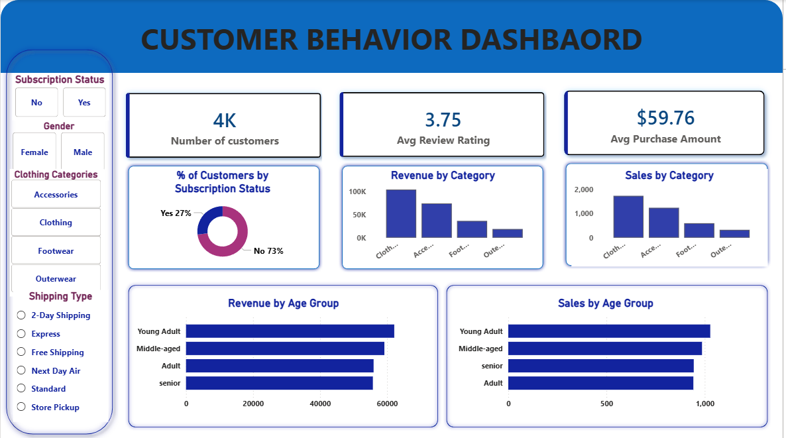

# Customer-Behavior-Anlalysis
End-to-end Customer Behavior Analysis project using Python (Pandas), PostgreSQL, and Power BI, featuring data cleaning, SQL-based insights, and STAR schema modeling to uncover revenue drivers and customer trends.

---

# 📊 Customer Behavior Analysis (End-to-End Data Project)

🚀 **Analyzed 4,000+ customers** to uncover revenue drivers, customer segments, and product performance using a full analytics stack:
**Python (Pandas) → PostgreSQL → Power BI (STAR Schema + DAX)**

---

## 🎯 Key Business Outcomes

* 📈 Identified **top revenue category (Clothing ~40%+)** → optimized marketing focus
* 👤 Discovered **highest value segment (Young Adults ~30–35%)** → improved targeting
* 🔁 Found **73% non-subscribers (~2.9K users)** → clear opportunity for recurring revenue
* 💸 Proved **discount users still spend ≥ avg ($59.76)** → supports strategic discounting
* 🚚 Showed **shipping impacts purchase value** → informs delivery strategy

---

## ⚙️ Tech Stack

* **Python (Pandas)** → Data Cleaning & Feature Engineering
* **PostgreSQL** → SQL Analysis (joins, aggregations, subqueries)
* **Power BI** → Dashboarding, DAX, Data Modeling
* **Data Modeling** → STAR Schema (Fact + Dimension tables)

---

## 🧠 What This Project Demonstrates

✔ End-to-end **data pipeline development**
✔ Strong **SQL problem-solving (real business questions)**
✔ **STAR schema modeling** for scalable analytics
✔ Translating data → **business decisions & impact**

---

## 🔄 Project Workflow

```text
Raw Data → Pandas (Cleaning & Transformation) → PostgreSQL (SQL Analysis) → Power BI (Dashboard)
```

---

## 🗄 SQL Analysis Highlights

* Revenue segmentation using `GROUP BY`
* Customer filtering using **subqueries**
* Product ranking using `AVG()` + `ORDER BY`
* Behavioral analysis (discounts, shipping impact)

---

## ⭐ Data Model (STAR Schema)

* **Fact Table:** Customer Transactions (purchase, rating, quantity)
* **Dimensions:** Customer, Product, Subscription, Shipping

👉 Optimized for:

* Faster queries
* Clean relationships
* Scalable BI reporting

---

## 📊 Dashboard Preview

### 🔹 Customer Behavior Dashboard



---

## 📌 Key Metrics

* 👥 Customers: **4,000+**
* 💰 Avg Purchase: **$59.76**
* ⭐ Avg Rating: **3.75**
* 📉 Non-Subscribers: **73% (~2,920 users)**

---

## 🚧 Challenges Solved

* Cleaned inconsistent & missing data using Pandas
* Designed efficient schema instead of flat tables
* Optimized queries for performance

---

## 🔮 Future Improvements

* RFM Segmentation (advanced analytics)
* Cohort & retention analysis
* Time-series trends (Date dimension)
* Profit & margin analysis

---

## 💼 Why This Matters

This project reflects how I approach real-world analytics:

➡️ Not just dashboards — **data-driven decision making**
➡️ Not just SQL — **business problem solving**
➡️ Not just tools — **end-to-end ownership**

---

## 📬 Let’s Connect

I’m actively seeking a **Data Analyst Internship**.
If you're hiring or working on data-driven products, let’s connect.

---

## ⭐ Support

If you found this project useful, consider giving it a ⭐

---

## ⚠️ Setup Note

Place your images inside:


---


Just tell me 👍
